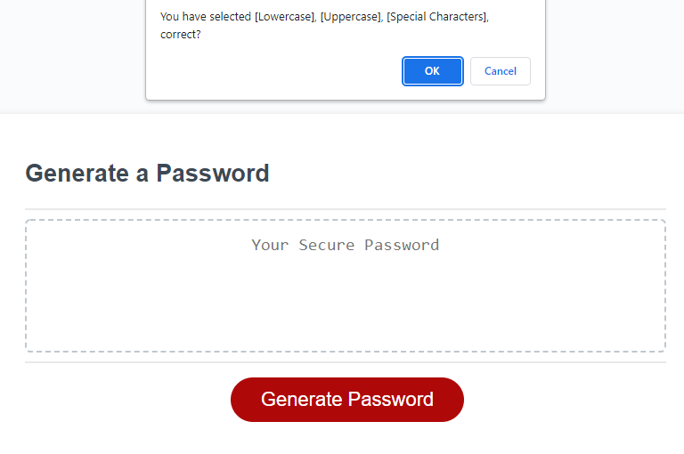

# Password Generator
application deployed at https://palminski.github.io/william-bolls-password-generating-rabit/

## Description
clicking the red button in the middle of the screen will cause messages to pop up requesting password parameters. First the user will be asked for a length which must be between 8 and 128.999 (as input will be rounded down to the neerest whole number). If they put in a number outside this range or something that can not be converted to an int they will be asked to give a proper input. Once they have put in a valid value, they will be asked to confirm it before moving on (selecting cancel here will loop back to asking for a number again). Following this, they will be asked on at a time weather they would like to include lowercase characters, upercase characters, numeric characters, and/or special characters. They will be reprompted if they don't agree to at least one type. They will then be asked to confirm that they chose all the character types they wanted (same as above) and a password will be generated.
## Notes
While I am pretty happy with this application I think that for the password gereating part my solution could have been a bit more elegant. I formed an array that was filled with other arrays based on the selected character types, and then randomly picked one of those arrays and a value from it to add to a string that would become the final password. I just typed out arrays containing all the characters like this:

let arrayLowercase = ["a","b","c","d","e","f","g","h","i","j","k","l","m","n","o","p","q","r","s","t","u","v","w","x","y","z"];

let arrayUppercase = ["A","B","C","D","E","F","G","H","I","J","K","L","M","N","O","P","Q","R","S","T","U","V","W","X","Y","Z"];

let arrayNumbers = [1,2,3,4,5,6,7,8,9,0];

let arraySpecialCharacters = [" ","!",'"',"#","$","%","&","'","(",")","*","+",",","-",".","/",":",";","<","=",">","?","@","[","\\","]","^","_","`","{","}","|","~"];

While this works well it looks a little "WET", and not very elegant. I may want to revisit this in the future and find a better way to store these characters.

